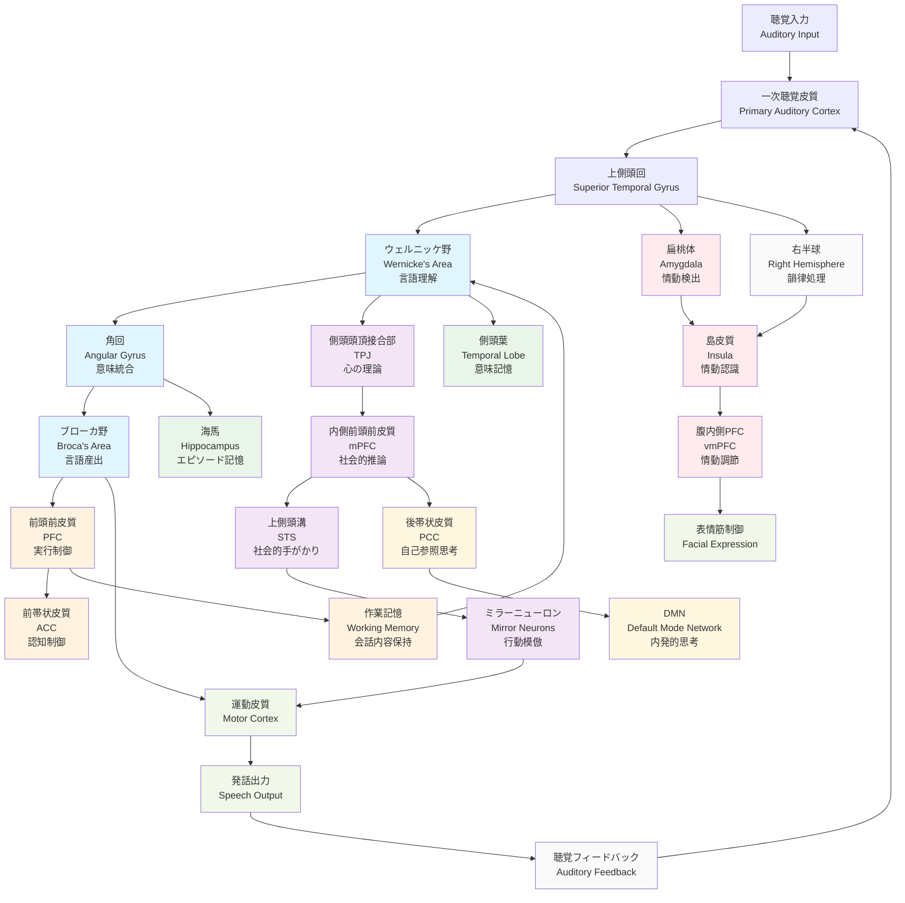

# 雑談時の脳機能研究 - Human Brain Activity During Casual Conversation

## 概要

雑談（カジュアルな会話）は人間の社会的コミュニケーションの基本的な形態であり、複数の脳領域が協調して働く複雑な認知プロセスです。本研究では、雑談中の脳の働きを包括的に分析し、Mermaid図として可視化します。

## 雑談における主要な脳プロセス

### 1. 言語処理（Language Processing）
- **ブローカ野（Broca's Area）**: 言語産出、文法処理
- **ウェルニッケ野（Wernicke's Area）**: 言語理解、意味処理
- **上側頭回（Superior Temporal Gyrus）**: 聴覚言語処理

### 2. 社会認知（Social Cognition）
- **内側前頭前皮質（Medial Prefrontal Cortex）**: 心の理論、他者の意図理解
- **側頭頭頂接合部（Temporoparietal Junction）**: 視点取得、共感
- **上側頭溝（Superior Temporal Sulcus）**: 社会的手がかりの処理

### 3. 注意制御（Attention Control）
- **前頭前皮質（Prefrontal Cortex）**: 実行機能、注意制御
- **前帯状皮質（Anterior Cingulate Cortex）**: 認知制御、紛争監視

### 4. 情動処理（Emotional Processing）
- **扁桃体（Amygdala）**: 情動的意味の処理
- **島皮質（Insula）**: 内受容感覚、情動認識
- **腹内側前頭前皮質（Ventromedial PFC）**: 情動調節

### 5. 記憶システム（Memory Systems）
- **海馬（Hippocampus）**: エピソード記憶、文脈記憶
- **側頭葉（Temporal Lobe）**: 意味記憶、語彙アクセス

### 6. デフォルトモードネットワーク（Default Mode Network）
- **後帯状皮質（Posterior Cingulate Cortex）**: 自己参照的思考
- **内側前頭前皮質（Medial PFC）**: 自己反省、未来思考
- **角回（Angular Gyrus）**: 概念統合、意味処理

## Mermaid図：雑談時の脳機能ネットワーク

## 雑談における特徴的な脳活動パターン

### 1. 同期化現象（Neural Synchronization）
雑談中、会話者同士の脳活動が同期する現象が観察されます：
- **話者-聞き手結合**: 話者のブローカ野と聞き手のウェルニッケ野の活動同期
- **情動共鳴**: 扁桃体と島皮質の活動同期による感情の共有

### 2. 予測処理（Predictive Processing）
- 相手の発言を予測する前頭前皮質の活動
- 文脈に基づく語彙予測（側頭葉）
- 社会的期待の形成（内側前頭前皮質）

### 3. 注意の動的配分（Dynamic Attention Allocation）
- 話題転換時の前帯状皮質活動増加
- 重要情報検出時の注意ネットワーク活性化
- マルチタスク処理（聞く・話す・考える）

### 4. 自発性と制御のバランス
- デフォルトモードネットワークによる自発的思考
- 実行制御ネットワークによる適切な応答選択
- 創造性ネットワークによる新奇なアイデア生成

## 雑談の神経科学的意義

### 社会的絆の形成
- オキシトシン分泌促進
- 社会的報酬系の活性化
- 信頼関係構築の神経基盤

### 認知機能の維持・向上
- 言語能力の練習効果
- 作業記憶の訓練
- 社会認知スキルの向上

### ストレス軽減効果
- コルチゾールレベルの低下
- 副交感神経系の活性化
- 情動調節能力の向上

## 結論

雑談は単純な情報交換ではなく、言語、社会認知、情動、記憶、注意制御など、人間の高次認知機能を総動員する複雑な脳活動です。この包括的な脳ネットワークの協調により、人間は効果的な社会的コミュニケーションを実現し、社会的絆を深めることができます。

## 参考文献・研究領域

- 神経言語学（Neurolinguistics）
- 社会神経科学（Social Neuroscience）  
- 認知神経科学（Cognitive Neuroscience）
- 会話分析（Conversation Analysis）
- ハイパースキャニング研究（Hyperscanning Studies）

---

**注**: この研究は、雑談における脳機能の複雑性と重要性を理解するための包括的な分析です。実際の脳活動は個人差や状況により大きく変動することにご注意ください。